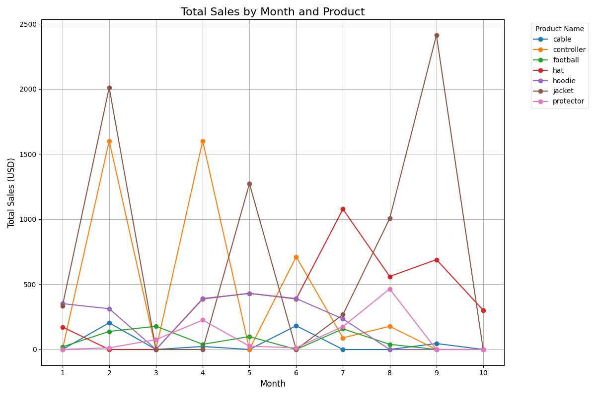
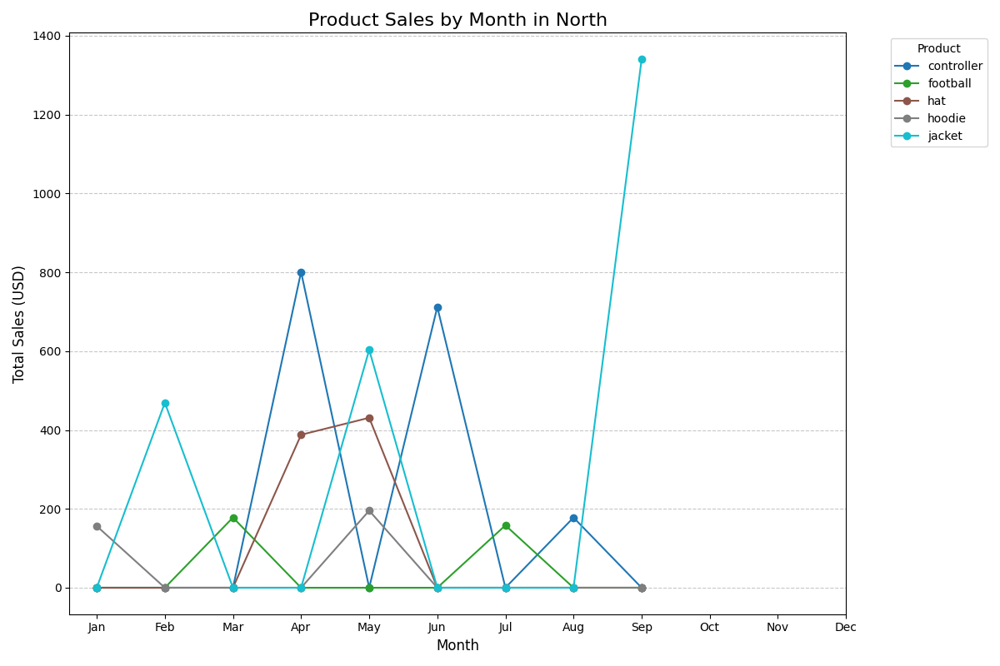

# smart-store-tommy
This repository is for Module 1 of BI and Analytics

## Project Setup
### 1. Create a Repository in GitHub
1. Name repository smart-store-kjleopold.
2. Make sure Public is selected.
3. Make sure to add README.md.
4. Create repository.

### 2. Clone Repo to Local
1. Copy URL to the GitHub Repository.
2. Open a terminal in the root (Project) folder.
3. Enter into terminal:
```
git clone (past URL)
```
4. Check that everything cloned as expected.

### 3. Create .gitignore and requirements.txt
1. Create new file in root project folder named: `.gitignore`
2. Create new file in root project folder named: `requirements.txt`
3. Find `.gitignore` file in course repo and copy/paste into local `.gitignore`
4. Find `requirements.txt` file in course repo and copy/paste into local `requirements.txt`

### 4. Git Add/Commit/Push
```
git add .
git commit -m "Add meaningful comment"
git push
```

### 5. Create Virtual Environment
1. From the root project folder:
```
py -m venv .venv
```
2. Accept VS Code suggestions.

### 6. Activate Virtual Environment
```
.venv\Scripts\activate
```

### 7. Install Dependencies
1. Verify .venv is activated (will have a green .venv in terminal)
2. Enter the following commands in PowerShell:
```
py -m pip install --upgrade pip setuptools wheel
py -m pip install -r requirements.txt
```

### 8. Select VS Code Interperter
1. Open the Command Pallette: `Ctrl+Shift+P`
2. Search for "Python: Select Interpreter"
3. Select local .venv option
4. Restart terminal
5. Activate .venv

### 9. Create Folders
1. data
   - raw
   - prepared
2. scripts
3. utils

### 10. Download Data Files
Find raw data .csv files in course repo and download to data\raw folder
- customers_data.csv
- products_data.csv
- sales_data.csv

### 11. Download and Install Power BI

### 12. Create logger.py and data_prep.py
1. Create `logger.py` file under utils folder
2. Find `logger.py` file in course repo and copy/paste contents into local `logger.py`
3. Create `data_prep.py` file under scripts folder
4. Find `data_prep.py` file under `smart-sales-starter-files` repo and copy/paste nto local `data_prep.py`
5. Execute Python script:
```
py scripts\data_prep.py
```
### 13. PIP List
1. colorama        
2. loguru          
3. numpy           
4. pandas          
5. pip             
6. python-dateutil 
7. pytz            
8. setuptools      
9. six             
10. tzdata          
11. win32_setctime  

### 14. Module 3 - Cleaning Data
In this module we used a data_prep.py and data_scrubber.py file. 

# Data Cleaning Process (using Python pandas)

1. Initial Data Inspection and Profiling

- df.info(): Check data types and identify missing values.
- df.describe(): Get summary statistics for numerical columns.
- df.head() and df.sample(): Inspect the structure and sample of the data.

2. Handle Missing Data

- Identify missing values: df.isnull().sum()
- Drop missing values: df.dropna()
- Fill missing values: df.fillna(value)

3. Remove Duplicates

- Identify duplicates: df.duplicated()
- Drop duplicates: df.drop_duplicates()

4. Filter or Handle Outliers

- Identify outliers: df.describe() and box plot visualization.
- Filter outliers: df[df['column'] < upper_bound]

5. Data Type Conversion and Standardization

- Convert data types: df.astype()
- Parse dates: pd.to_datetime(df['column'])

6. Standardize and Format Data

- Apply string formatting: df['column'].str.lower() and df['column'].str.strip()
- Rename columns: df.rename(columns={'old_name': 'new_name'})

7. Column Management

- Drop unnecessary columns: df.drop(columns=['column'])
- Reorder columns: df = df[['col1', 'col2', ...]]

8. Data Integration and Aggregation

- Merge data: pd.merge(df1, df2, on='key_column')
- Aggregate data: df.groupby().agg()

9. Final Quality Checks

- Check data consistency, completeness, and final structure.

We then used the following script in the terminal to test if the data_scrubber.py was working

py tests\test_data_scrubber.py

# Define, Create, and Populate Your DW Schema

For debugging reasons, it helps to test and get the SQL correct FIRST before combining it into your Python. You can inline the SQL - or keep the .sql file separate in your repo.

It's important to make sure that the scheme matches the rows exactly in order to ensure that they pull correctly.

# P5. Cross-Platform Reporting with Power BI & Spark

downloaded ODBC and then added ODBC Data Source Name 

Linked vsc project to PowerBI using ODBC

Created a new table to fetch total revenue per customer
```
SELECT c.name, SUM(s.amount) AS total_spent
FROM sale s
JOIN customer c ON s.customer_id = c.customer_id
GROUP BY c.name
ORDER BY total_spent DESC;
```

Used visual panes to show how data can be utilized. 

### Module 6 - BI Insights and Storytelling

## Section 1. The Business Goal
   • 	The CEO of Smart Store wants to run a new marketing campaign to pick up sales in the slowest months of the year, outside of the holiday months of November and December. The goal is to figure out when those months are, which products are underperforming during those months, and if there is a mode of communication that is preferred based on total customer sales to push the marketing campaign through. 
## Section 2. Data Source
   •	What information did you start with (prepared data, data warehouse, or pre-computed cube)? I used an olap_cubing file which generates an OLAP (Online Analytical Processing) cube from raw sales data stored in my SQLite database.
   •	Clearly indicate which columns of which tables were used: From my sales table I used SaleDate, ProductID, CustomerID, SaleAmount, TransactionID. From the products table I used ProductID, ProductName, Category. From the customers table I used ContactMethod.
## Section 3. Tools
   •	Tell us what tools you used and why: I used the script that was provided in denisecase/smart-sales-olap to get started. I then used Microsoft CoPilot when I hit a snag. 
## Section 4. Workflow & Logic
   •	Describe the dimensions and aggregations - the logic needed for your analysis: 
   •	Dimensions: The dimensions I used were Month extracted from SaleDate, ProductID, ProductName, Category, CustomerID, PreferredContactMethod
   •	Aggregations: For Total Sales I used the sum of sales and grouped it by month as well as ProductID, PreferredContactMethod, and ProductID/ ProductName. 
   •	Logic: To ID the slowest month I grouped the sales data by month and calculated total sales. A bar chart easily visualizes the two slowest months. Once those months have been identified, I created a line graph to get a visual at a glance of the total sales of each individual product throughout the year using the sum of totalsales by product. I also created a table to go with the line graph to breakout the products that sold the fewest in March and October. Once the months and products are selected, I wanted to find the communication medium to reach customers. For this I grouped sales data by PreferredContactMethod and calculated the total sales. I placed this in a bar chart to show which method the most lucrative customers preferred.  
## Section 5 and 6. Results and Suggested Business Action 
   •	Present your insights with narrative, visualizations any suggested actions based on the results you uncovered
   After looking through the visuals and information that was gathered, it appears the two lowest earning months outside the holidays are March and October. As these months are spread throughout the year, it would be my suggestion to run two separate marketing campaigns. 
   Once the months were identified, it was time to predetermine the products that would be highlighted in these campaigns. For March, data shows that the two lowest earning products were the protector and the football. To promote these items the campaign can center around the warming weather and the future pool parties people will have. Ads can feature kids playing with a football in the pool and water splashing on a phone that is protected by a screen protector. For October, data shows that hats are the slowest moving. This campaign could center around NFL team hats during the football season. 
   At this point we have the products and months we want to run for our campaign, but we need to determine the medium to push this marketing campaign out to. The top two preferred contact methods are through text messages and telephone. This shows that their customers like to consume media through their phones. So a marketing campaign that centers around mobile targeted advertising coupled with text messaging should resonate well with their key consumers. 
## Results and Visualizations

### Total Sales by Contact Method


### Products Sold by Month (Line Graph)


### Underperforming Products in March and October


### Total Sales by Month


## Section 7. Challenges
   •	Mention any challenges you encountered and how they were resolved.
   I didn’t really have any challenges. I had to force myself not to get too in depth with this marketing campaign. I wanted to drill down further and really dissect target markets and inventory trends throughout the year. 

### Module 7 - Custom BI Project 

## Section 1. 
   The Business Goal : Create an advertising campaign that combines the lowest and highest selling items in the lowest selling months for each region.
## Section 2. 
   Data Source: I used the prepared database from previous weeks. 
## Section 3. 
   Tools Used: I used VSC and Microsoft Copilot
## Section 4. 
   Workflow & Logic: Since I am working on limited data, I am assuming the months with no sales indicates the stores were closed for those months. So I am focusing on months with sales data. Once we have that assumption, I want to identify the lowest salling months by region. I then want to analyze product sales during the lowest selling month using productid and with total sales. The I want to identify the lowest and highest selling products using the month we found.
## Section 5. Results (narrative + visualizations): 
   The first thing I wanted to do was find the lowest selling months by region. I then made a csv file to easily read the visual. 

   ### Total Sales by Month and Region
   

   From there it was showing what category the company sees the highest sales in without the campaign. This gives decision makers a basis to help gauge the rest of the charts. 

   ### Least and Best Performing Months by Region

   The results of the analysis can be found in the following CSV file:

   [Least and Best Performing Months by Region](data/results/least_and_best_performing_months_by_region.csv)

   From there it was showing what category the company sees the highest sales in without the campaign. This gives decision makers a basis to help gauge the rest of the charts. 

   ### Most Purchased Products by Region
   

   Now that we know what our strongest products are by region, I break down the product sales by month by region. 

   ### Product Sales by Month and Region

   #### East Region
   

   #### North Region
   

   #### South Region
   

   #### West Region
   

## Section 6. Suggested Business Action: 
      East – September – Only sold cables that month, no other sales
      North – January – Only sold Hoodies, no other sales
      South – January – Only sold hoodies, no other sales
      West – August – Only sold protectors, no other items sold. 
   For each regions lowest selling months there was only one type of product sold. So when developing a marketing campaign we want to base our campaign around ‘cables’ in the east, which we could pair with protectors. Hoodies in both the North and South which we could pair with hats or jackets. In the west the highest selling product was protectors, which we could sell with cables, but also showcase hats and footballs as football season gears up.
## Section 7. Challenges: 
   My only challenge was working with the limited data. I am used to using years of data to come up with campaigns. One year is not a lot of time. 
## Section 8. Ethical Considerations: 
   With advertising, you want to make sure you are always running balanced promotions ensuring that the campaign isn’t unfairly pressuring customers. Even though regions might have varying consumer behavior, it’s important to ensure that one region isn’t favored over another. It’s also important to consider customer preferences if they choose to opt out. From a data perspective, it’s always important to make sure that the data is secured and is being used with how it was intended (ie not sold to a data company)
